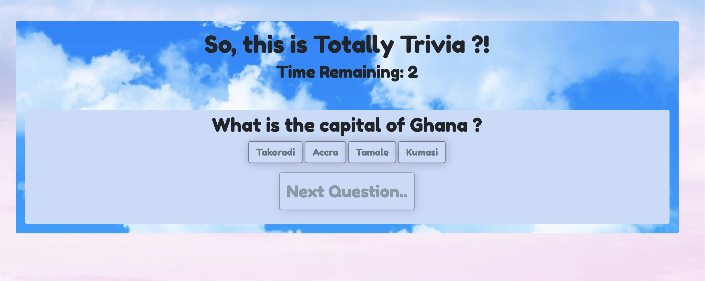

# TriviaGame

Trivia game using JavaScript for the logic and jQuery to manipulate HTML. App includes HTML and CSS.

To view live application:  https://johandenver.github.io/TriviaGame/

Contains a Trivia form with multiple choice and/or true/false answer options.

* The player will have a limited amount of time to finish the quiz. 

* The game ends when the time runs out. The page will reveal the number of questions that players answer correctly and incorrectly.

* The Player cannot pick more than one answer per question.

* Game includes a countdown timer.

## Getting Started

Download zip file.

Open file in IDE of choice to view code.

Open index.html in browser to view application.

## Built With

* [Javascript](https://developer.mozilla.org/en-US/docs/Web/JavaScript) - The programming language used for all logic of the    game.
* [Bootstrap](https://getbootstrap.com/) - Used components from toolkit for developing the HTML layout. 
* [CSS](https://developer.mozilla.org/en-US/docs/Web/css) - used for styling of the application.
* [Google Fonts](https://fonts.google.com/) - Used to generate font styles.

## Authors

* **Jonathan Peine - Initial work - [Github](https://github.com/johandenver)

## Acknowledgments

* Would love to give a shout out to the TAs, Instructors and Tutors! 